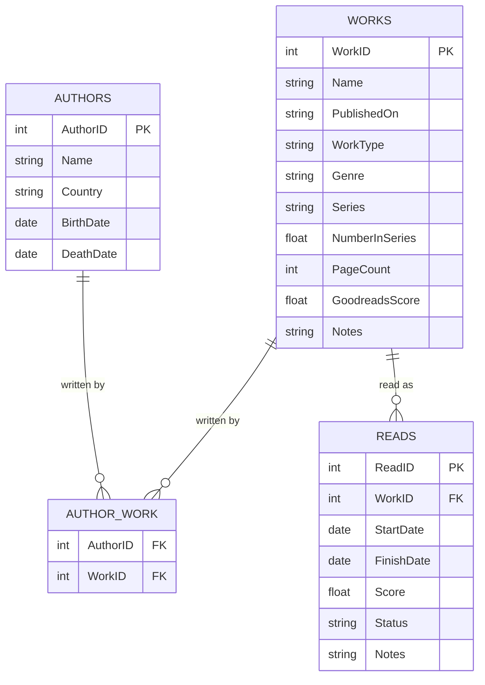

    <h1>Reading Stats</h1>

This repository explores data related to my personal reading habits. All data is stored in a relational database at `data/raw/books.db`. Scripts for querying, data processing, and plotting are located in the `src/` directory.

## Database

The database consists of four tables, as described below. Missing values are represented as `NULL`.

- `AUTHORS` contains information about individual authors:
    - `AuthorID`: An integer serving as a unique identifier for the author.
    - `Name`: The author's name as a string.
    - `Country`: The country of birth, coded using the [ISO 3166-1 alpha-3 standard](https://en.wikipedia.org/wiki/ISO_3166-1_alpha-3).
    - `BirthDate`: The date of birth in `YYYY-MM-DD` format. If only the year is known (e.g., 1954), the month and day are set to `01`, resulting in `1954-01-01`.
    - `DeathDate`: The date of death in `YYYY-MM-DD` format. If only the year is known (e.g., 1954), the month and day are set to `01`, resulting in `1954-01-01`.
- `WORKS` contains information about individual works:
    - `WorkID`: An integer serving as a unique identifier for the work.
    - `Name`: The name of the work as a string.
    - `PublishedOn`: The year of publication in `YYYY` format.
    - `WorkType`: The type of work. Possible values are: `Novella`, `Short Story`, `Novel`, `Novelette`, `Non-Fiction`, `Anthology`, `Graphic Novel`, or `Poetry`. Most works are classified based on [The Internet Speculative Fiction Database](https://www.isfdb.org/).
    - `Genre`: The (subjective) genre of the work. For example: `Fiction: Horror: Cosmic`. See below for a complete list of genres.
    - `Series`: The series to which the work belongs.
    - `NumberInSeries`: The order of the work within its series, as a float.
    - `PageCount`: The number of pages in the work.
    - `GoodreadsScore`: The Goodreads score for the work. For short stories or works contained in anthologies or collections, the score is that of the parent work. For example, the short story "What Brings the Void" uses the score of the *Cthulhu's Reign* anthology.
    - `Notes`: Optional notes about this work (e.g., recommendations, tropes, topics).
- `AUTHOR_WORK` links authors and works, and contains only two fields: `AuthorID` and `WorkID`.
- `READS` contains information about each reading instance:
    - `ReadID`: An integer serving as a unique identifier for the read.
    - `WorkID`: The work being read, as in `WORKS`.
    - `StartDate`: The start date of the reading, in `YYYY-MM-DD` format.
    - `FinishDate`: The finish date of the reading, in `YYYY-MM-DD` format.
    - `Score`: The score given to this reading, as a float.
    - `Status`: The current status of the reading. Possible values are `FINISHED`, `NOT FINISHED`, `NEXT` or `IN PROGRESS`.
    - `Notes`: Optional notes about this work (e.g., thoughts).

## Showcase

    

---

    

## Genres

- Fiction: Adventure
- Fiction: Contemporary
- Fiction: Crime
- Fiction: Drama
- Fiction: Fantasy
    - Fiction: Fantasy: Epic
    - Fiction: Fantasy: Grimdark
    - Fiction: Fantasy: High
    - Fiction: Fantasy: Historical
    - Fiction: Fantasy: Low
- Fiction: Historical
- Fiction: Horror
    - Fiction: Horror: Cosmic
    - Fiction: Horror: Folk
    - Fiction: Horror: Gothic
- Fiction: Literary
- Fiction: Magic Realism
- Fiction: Mystery
- Fiction: Science Fiction
    - Fiction: Science Fiction: Alternative History
    - Fiction: Science Fiction: Apocalyptic
    - Fiction: Science Fiction: Biopunk
    - Fiction: Science Fiction: Climate
    - Fiction: Science Fiction: Cyberpunk
    - Fiction: Science Fiction: Dystopian
    - Fiction: Science Fiction: Grimdark
    - Fiction: Science Fiction: Hard
    - Fiction: Science Fiction: Horror
    - Fiction: Science Fiction: Space Opera
    - Fiction: Science Fiction: Steampunk
- Fiction: Thriller
- Non-Fiction:
    - Non-Fiction: Biography
    - Non-Fiction: Biology
    - Non-Fiction: Crime
    - Non-Fiction: Games
    - Non-Fiction: History
    - Non-Fiction: Music
    - Non-Fiction: Mythology
    - Non-Fiction: Philosophy
    - Non-Fiction: Politics
    - Non-Fiction: Psychology
    - Non-Fiction: Religion
    - Non-Fiction: Science
    - Non-Fiction: Travel
    - Non-Fiction: Writing
- Play
- Poetry

## To-Read Next

| AuthorName                  | WorkName           | WorkType   | Series       |   NumberInSeries |   GoodreadsScore |
|:----------------------------|:-------------------|:-----------|:-------------|-----------------:|-----------------:|
| Stephen King & Peter Straub | Black House        | Novel      | The Talisman |                2 |             4.03 |
| Robert A. Heinlein          | The Puppet Masters | Novel      |              |                  |             3.88 |
| Dan Simmons                 | Song of Kali       | Novel      |              |                  |             3.61 |

## Stephen King

| Title                                     | Type        | Series         |   Order |   PublishedOn |   PageCount |   MyScore |   GoodreadsScore | LastReadOn   | ReadStatus   |
|:------------------------------------------|:------------|:---------------|--------:|--------------:|------------:|----------:|-----------------:|:-------------|:-------------|
| Cain Rose Up                              | Short Story |                |         |          1968 |           6 |           |             3.97 |              |              |
| Here There Be Tygers                      | Short Story |                |         |          1968 |           6 |           |             3.97 |              |              |
| Strawberry Spring                         | Short Story |                |         |          1968 |          12 |      3.75 |             4.04 | 2025-03-09   | FINISHED     |
| Night Surf                                | Short Story |                |         |          1969 |           9 |      3.75 |             4.04 | 2025-03-06   | FINISHED     |
| The Reaper's Image                        | Short Story |                |         |          1969 |           8 |           |             3.97 |              |              |
| Graveyard Shift                           | Short Story |                |         |          1970 |          18 |      4    |             4.04 | 2025-03-06   | FINISHED     |
| I Am the Doorway                          | Short Story |                |         |          1971 |          16 |      3.5  |             4.04 | 2025-03-07   | FINISHED     |
| Battleground                              | Short Story |                |         |          1972 |          13 |      3.75 |             4.04 | 2025-03-08   | FINISHED     |
| The Mangler                               | Novelette   |                |         |          1972 |          26 |      3.75 |             4.04 | 2025-03-07   | FINISHED     |
| The Boogeyman                             | Short Story |                |         |          1973 |          15 |      3.9  |             4.04 | 2025-03-08   | FINISHED     |
| Gray Matter                               | Short Story |                |         |          1973 |          16 |      4    |             4.04 | 2025-03-08   | FINISHED     |
| Trucks                                    | Short Story |                |         |          1973 |          22 |      3.5  |             4.04 | 2025-03-08   | FINISHED     |
| Sometimes They Come Back                  | Novelette   |                |         |          1974 |          36 |      4    |             4.03 | 2025-03-09   | FINISHED     |
| Carrie                                    | Novel       |                |         |          1974 |         272 |      3.75 |             3.98 |              | FINISHED     |
| ‘Salem's Lot                              | Novel       |                |         |          1975 |         483 |      4    |             4.06 |              | FINISHED     |
| The Lawnmower Man                         | Short Story |                |         |          1975 |          12 |      3.75 |             4.04 | 2025-03-09   | FINISHED     |
| I Know What You Need                      | Novelette   |                |         |          1976 |          29 |      3.75 |             4.04 | 2024-03-10   | FINISHED     |
| The Ledge                                 | Short Story |                |         |          1976 |          22 |      3.5  |             4.04 | 2025-03-09   | FINISHED     |
| One for the Road                          | Short Story |                |         |          1977 |          21 |      4    |             4.04 | 2025-03-11   | FINISHED     |
| Children of the Corn                      | Novelette   |                |         |          1977 |          38 |      3.75 |             4.04 | 2025-03-11   | FINISHED     |
| The Shining                               | Novel       | The Shining    |       1 |          1977 |         497 |      4.5  |             4.27 |              | FINISHED     |
| The Man Who Loved Flowers                 | Short Story |                |         |          1977 |           7 |      3.25 |             4.04 | 2025-03-11   | FINISHED     |
| Rage                                      | Novel       |                |         |          1977 |         131 |           |             3.73 |              |              |
| The Stand                                 | Novel       |                |         |          1978 |        1152 |      4.99 |             4.35 |              | FINISHED     |
| Jerusalem's Lot                           | Novelette   |                |         |          1978 |          35 |      4.5  |             4.03 | 2025-03-06   | FINISHED     |
| Nona                                      | Novelette   |                |         |          1978 |          30 |           |             3.97 |              |              |
| The Last Rung on the Ladder               | Short Story |                |         |          1978 |          15 |      4.25 |             4.04 | 2025-03-11   | FINISHED     |
| The Woman in the Room                     | Short Story |                |         |          1978 |          17 |      3.15 |             4.04 | 2025-03-12   | FINISHED     |
| Quitters, Inc.                            | Short Story |                |         |          1978 |          26 |      3.75 |             4.04 | 2025-03-10   | FINISHED     |
| The Long Walk                             | Novel       |                |         |          1979 |         370 |           |             4.09 |              |              |
| The Dead Zone                             | Novel       |                |         |          1979 |         402 |      4    |             3.96 |              | FINISHED     |
| Big Wheels: A Tale of the Laundry Game    | Short Story |                |         |          1980 |          14 |           |             3.97 |              |              |
| Firestarter                               | Novel       |                |         |          1980 |         564 |      3.75 |             3.91 |              | FINISHED     |
| The Wedding Gig                           | Short Story |                |         |          1980 |          14 |           |             3.97 |              |              |
| The Monkey                                | Novelette   |                |         |          1980 |          34 |           |             3.97 |              |              |
| The Mist                                  | Novella     |                |         |          1980 |         176 |      4    |             3.97 |              | FINISHED     |
| The Man Who Would Not Shake Hands         | Short Story |                |         |          1981 |          16 |           |             3.97 |              |              |
| Cujo                                      | Novel       |                |         |          1981 |         432 |      3.75 |             3.78 |              | FINISHED     |
| The Jaunt                                 | Novelette   |                |         |          1981 |          24 |           |             3.97 |              |              |
| Roadwork                                  | Novel       |                |         |          1981 |         320 |           |             3.6  |              |              |
| The Reach                                 | Short Story |                |         |          1981 |          20 |           |             3.97 |              |              |
| The Raft                                  | Novelette   |                |         |          1982 |          26 |           |             3.97 |              |              |
| Apt Pupil                                 | Novel       |                |         |          1982 |         196 |      4.25 |             4.35 | 2025-03-05   | FINISHED     |
| The Running Man                           | Novel       |                |         |          1982 |         317 |           |             3.9  |              |              |
| Survivor Type                             | Short Story |                |         |          1982 |          18 |           |             3.97 |              |              |
| The Body                                  | Novel       |                |         |          1982 |         154 |      4.5  |             4.35 |              | FINISHED     |
| The Breathing Method                      | Novella     |                |         |          1982 |          66 |           |             4.35 |              |              |
| The Gunslinger                            | Novel       | The Dark Tower |       1 |          1982 |         231 |      4.5  |             3.92 |              | FINISHED     |
| Rita Hayworth and Shawshank Redemption    | Novella     |                |         |          1982 |         102 |      4    |             4.35 |              | FINISHED     |
| Pet Sematary                              | Novel       |                |         |          1983 |         580 |      4.7  |             4.06 |              | FINISHED     |
| Uncle Otto's Truck                        | Short Story |                |         |          1983 |          16 |           |             3.97 |              |              |
| Word Processor of the Gods                | Short Story |                |         |          1983 |          18 |           |             3.97 |              |              |
| Christine                                 | Novel       |                |         |          1983 |         411 |      3.5  |             3.84 |              | NOT FINISHED |
| Cycle of the Werewolf                     | Novella     |                |         |          1983 |         128 |           |             3.67 |              |              |
| The Eyes of the Dragon                    | Novel       |                |         |          1984 |         427 |           |             3.94 |              |              |
| Mrs. Todd's Shortcut                      | Novelette   |                |         |          1984 |          22 |           |             3.97 |              |              |
| Gramma                                    | Novelette   |                |         |          1984 |          28 |           |             3.97 |              |              |
| Beachworld                                | Short Story |                |         |          1984 |          16 |           |             3.97 |              |              |
| The Ballad of the Flexible Bullet         | Novella     |                |         |          1984 |          44 |           |             3.97 |              |              |
| The Talisman                              | Novel       | The Talisman   |       1 |          1984 |         569 |      4.15 |             4.12 | 2025-01-28   | FINISHED     |
| Thinner                                   | Novel       |                |         |          1984 |         320 |           |             3.77 |              |              |
| For Owen                                  | Poetry      |                |         |          1985 |           2 |           |             3.97 |              |              |
| Morning Deliveries                        | Short Story |                |         |          1985 |           6 |           |             3.97 |              |              |
| Paranoid: A Chant                         | Poetry      |                |         |          1985 |           4 |           |             3.97 |              |              |
| It                                        | Novel       |                |         |          1986 |        1168 |      4.97 |             4.24 |              | FINISHED     |
| Misery                                    | Novel       |                |         |          1987 |         370 |      4    |             4.21 |              | FINISHED     |
| The Drawing of the Three                  | Novel       | The Dark Tower |       2 |          1987 |         463 |      4.7  |             4.23 |              | FINISHED     |
| The Tommyknockers                         | Novel       |                |         |          1987 |         747 |      3.25 |             3.59 |              | NOT FINISHED |
| The Dark Half                             | Novel       |                |         |          1989 |         469 |      3.75 |             3.8  |              | FINISHED     |
| The Langoliers                            | Novella     |                |         |          1990 |         206 |      3.9  |             3.95 |              | FINISHED     |
| The Stand: The Complete and Uncut Edition | Novel       |                |         |          1990 |        1348 |           |             4.35 |              |              |
| The Sun Dog                               | Novella     |                |         |          1990 |         150 |           |             3.95 |              |              |
| Secret Window, Secret Garden              | Novella     |                |         |          1990 |         130 |      4.15 |             3.95 |              | FINISHED     |
| The Library Policeman                     | Novella     |                |         |          1990 |         198 |           |             3.95 |              |              |
| Needful Things                            | Novel       |                |         |          1991 |         790 |      3.5  |             3.97 |              | NOT FINISHED |
| The Waste Lands                           | Novel       | The Dark Tower |       3 |          1991 |         590 |      4.83 |             4.25 |              | FINISHED     |
| Dolores Claiborne                         | Novel       |                |         |          1992 |         384 |           |             3.92 |              |              |
| Gerald's Game                             | Novel       |                |         |          1992 |         332 |           |             3.57 |              |              |
| Insomnia                                  | Novel       |                |         |          1994 |         896 |      3.5  |             3.83 |              | FINISHED     |
| Rose Madder                               | Novel       |                |         |          1995 |         595 |           |             3.75 |              |              |
| Desperation                               | Novel       |                |         |          1996 |         547 |      3.75 |             3.85 |              | FINISHED     |
| The Regulators                            | Novel       |                |         |          1996 |         512 |           |             3.72 |              |              |
| The Green Mile                            | Novel       |                |         |          1996 |         592 |      4.2  |             4.48 |              | FINISHED     |
| Wizard and Glass                          | Novel       | The Dark Tower |       4 |          1997 |         845 |      4.1  |             4.26 |              | FINISHED     |
| Bag of Bones                              | Novel       |                |         |          1998 |         736 |           |             3.92 |              |              |
| The Road Virus Heads North                | Novelette   |                |         |          1999 |          34 |           |             3.97 |              |              |
| 1408                                      | Novelette   |                |         |          1999 |          54 |           |             3.97 |              |              |
| The Girl Who Loved Tom Gordon             | Novel       |                |         |          1999 |         264 |           |             3.63 |              |              |
| Low Men in Yellow Coats                   | Novella     |                |         |          1999 |         243 |      4.5  |             3.85 |              | FINISHED     |
| Hearts in Atlantis                        | Novella     |                |         |          1999 |         148 |           |             3.85 |              |              |
| On Writing: A Memoir of the Craft         | Non-Fiction |                |         |          2000 |         320 |      4.5  |             4.34 |              | FINISHED     |
| Riding the Bullet                         | Novelette   |                |         |          2000 |          66 |           |             3.97 |              |              |
| Black House                               | Novel       | The Talisman   |       2 |          2001 |         659 |           |             4.03 |              | NEXT         |
| Dreamcatcher                              | Novel       |                |         |          2001 |         688 |           |             3.65 |              |              |
| From a Buick 8                            | Novel       |                |         |          2002 |         356 |           |             3.48 |              |              |
| Wolves of the Calla                       | Novel       | The Dark Tower |       5 |          2003 |         960 |      4.5  |             4.19 |              | FINISHED     |
| Song of Susannah                          | Novel       | The Dark Tower |       6 |          2004 |         544 |      4.7  |             3.99 |              | FINISHED     |
| The Dark Tower                            | Novel       | The Dark Tower |       7 |          2004 |        1050 |      4.94 |             4.28 |              | FINISHED     |
| The Colorado Kid                          | Novel       |                |         |          2005 |         178 |           |             3.38 |              |              |
| Cell                                      | Novel       |                |         |          2006 |         449 |      3    |             3.66 |              | FINISHED     |
| Lisey's Story                             | Novel       |                |         |          2006 |         513 |           |             3.7  |              |              |
| Blaze                                     | Novel       |                |         |          2007 |         285 |           |             3.76 |              |              |
| Duma Key                                  | Novel       |                |         |          2008 |         611 |           |             3.97 |              |              |
| Under the Dome                            | Novel       |                |         |          2009 |        1074 |      3.75 |             3.92 |              | FINISHED     |
| 11/22/63                                  | Novel       |                |         |          2011 |         849 |      4.96 |             4.33 |              | FINISHED     |
| The Wind Through the Keyhole              | Novel       |                |         |          2012 |         322 |      4    |             4.14 |              | FINISHED     |
| Doctor Sleep                              | Novel       | The Shining    |       2 |          2013 |         531 |      4    |             4.13 |              | FINISHED     |
| Joyland                                   | Novel       |                |         |          2013 |         285 |           |             3.93 |              |              |
| Mr. Mercedes                              | Novel       | Bill Hodges    |       1 |          2014 |         437 |      3.75 |             4.01 |              | FINISHED     |
| Revival                                   | Novel       |                |         |          2014 |         405 |           |             3.8  |              |              |
| Finders Keepers                           | Novel       | Bill Hodges    |       2 |          2015 |         434 |      3.75 |             4.06 |              | FINISHED     |
| End of Watch                              | Novel       | Bill Hodges    |       3 |          2016 |         432 |           |             4.1  |              |              |
| Sleeping Beauties                         | Novel       |                |         |          2017 |         702 |           |             3.73 |              |              |
| Gwendy's Button Box                       | Novel       | The Button Box |       1 |          2017 |         171 |           |             3.92 |              |              |
| Elevation                                 | Novel       |                |         |          2018 |         146 |      4.08 |             3.64 | 2026-03-01   | FINISHED     |
| The Outsider                              | Novel       |                |         |          2018 |         561 |           |             4.01 |              |              |
| The Institute                             | Novel       |                |         |          2019 |         561 |      3.5  |             4.2  |              | FINISHED     |
| Later                                     | Novel       |                |         |          2021 |         248 |           |             3.98 |              |              |
| Billy Summers                             | Novel       |                |         |          2021 |         515 |           |             4.2  |              |              |
| Fairy Tale                                | Novel       |                |         |          2022 |         608 |           |             4.12 |              |              |
| Gwendy's Final Task                       | Novel       | The Button Box |       3 |          2022 |         288 |           |             4.05 |              |              |
| Holly                                     | Novel       |                |         |          2023 |         449 |           |             4.16 |              |              |
| Never Flinch                              | Novel       |                |         |          2025 |         448 |           |             3.82 |              |              |

